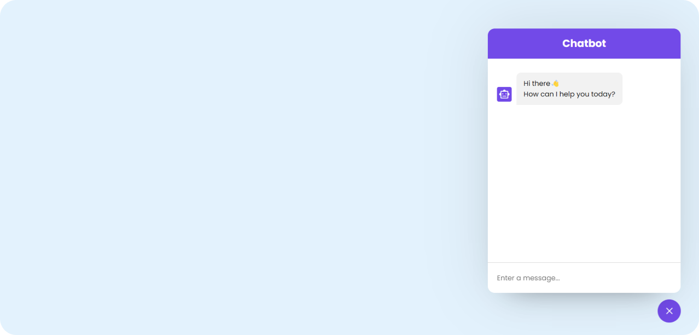

# ChatBot 
> This repository contains a simple chatbot application built using HTML, CSS, and JavaScript. The chatbot is designed to interact with users in a conversational manner, utilizing an external API for responses. This README will guide you through the setup and usage of the chatbot application.

 

 ## Demo Screenshots

 

## Features
- **Interactive chat interface.**
- **Real-time responses from an external API.**
- **User-friendly design with CSS styling.**
